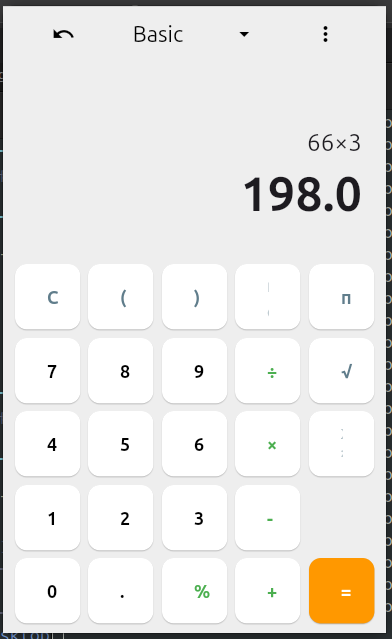

# Calculator App

A simple calculator application built with Flutter for desktop.

## Features

- Basic arithmetic operations (addition, subtraction, multiplication, division).
- Scientific functions (modulus, pi, square root, power of 2).
- Clear and undo functionality.
- Responsive UI with a clean, modern design.
- Draggable window by clicking on the app bar.

## Screenshot



*(Note: The actual screenshot will be placed in the `assets/screenshot.png` path after generation.)*

## Getting Started

These instructions will get you a copy of the project up and running on your local machine for development and testing purposes.

### Prerequisites

- Flutter SDK installed.
- A desktop environment (Linux, Windows, macOS) for running the desktop application.

### Installation

1.  **Clone the repository:**
    ```bash
    git clone <repository_url>
    cd calculator
    ```
2.  **Get dependencies:**
    ```bash
    flutter pub get
    ```

### Running the application

To run the application on your Linux desktop:

```bash
flutter run -d linux
```

## Project Structure

The project follows a modular structure for better organization and maintainability:

```
lib/
├── ui/
│   ├── widgets/
│   │   ├── calculator_app_bar.dart    # AppBar widget for the calculator
│   │   ├── calculator_button.dart     # Custom button widget
│   │   └── calculator_display.dart    # Display area widget
│   └── calculator_screen.dart         # Main UI screen for the calculator
├── logic/
│   └── calculator_logic.dart          # Business logic for calculator operations
├── utils/
│   └── constants.dart                 # Application-wide constants (e.g., button texts, colors)
└── main.dart                          # Entry point of the application
```